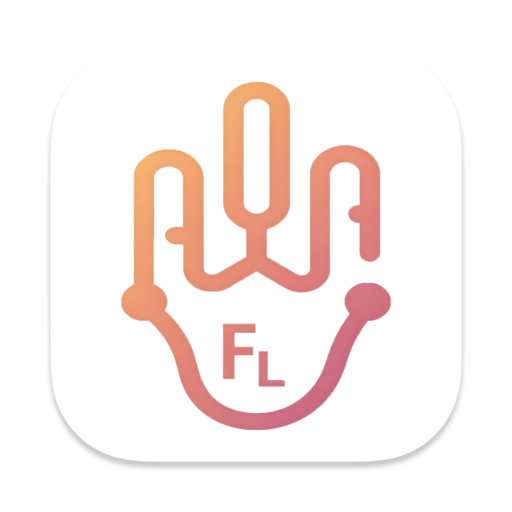

  

<h1 align="center">FingerLike</h1>

[English](README_EN.md) | 简体中文

一个简单的基于 Flutter 构建的鼠标连点器。

## 功能特点

- 🎯 支持普通点击和仿生点击模式
- ⚡️ 仿生模式自适应点击速度调节
- 🎨 支持深色/浅色主题切换
- 🌍 支持中英文界面
- 📊 点击任务记录和统计
- 💫 流畅的动画和现代化界面
- 🔒 安全可靠，无需管理员权限

## 功能截图

  &nbsp;&nbsp;
  

  &nbsp;&nbsp;
  &nbsp;&nbsp;
  

## 安装说明

### macOS

1. 下载最新版本的 DMG 安装包
2. 打开 DMG 文件并将应用拖入 Applications 文件夹
3. 首次运行时，需要在系统偏好设置中允许辅助功能权限

### Windows
1. 下载最新版本的 exe 安装包
2. 打开 exe 文件进行安装

### Android
1. 下载最新版本的 APK 安装包
2. 打开 APK 文件并进行安装
3. 首次运行时，需要在系统设置中开启无障碍权限

## 使用指南

1. 启动应用后，选择需要的点击模式：
   - 普通模式：固定位置连续点击
   - 仿生模式：模拟人工点击，带有随机偏移
2. 设置点击次数
3. 点击开始按钮，倒计时结束后自动开始任务
4. 倒计时结束前需要将鼠标移动到目标位置

## 配置说明

- 主题设置：支持浅色/深色/跟随系统
- 语言设置：支持中文/英文
- 点击记录：可设置最大保存数量

## 版本历史

查看 [更新日志](CHANGELOG.md) 了解详细更新内容。

## 反馈与支持

如有问题或建议，欢迎提交 Issue。

## 许可证

本项目基于 MIT 许可证开源。
