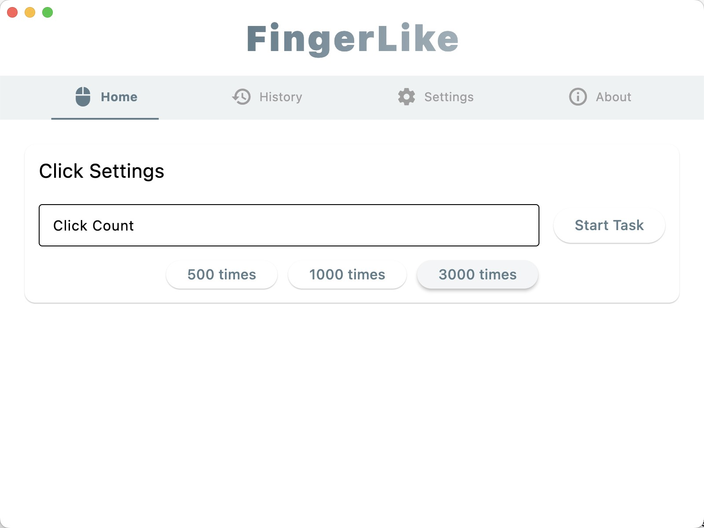
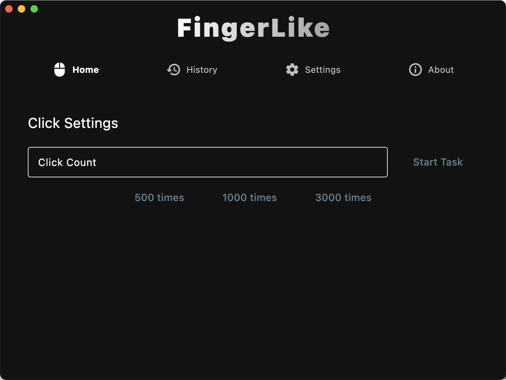

  

<h1 align="center">FingerLike</h1>

简体中文 | [English](README_EN.md)

A simple mouse auto-clicker built with Flutter.

## Features

- 🎯 Normal and Bionic clicking modes
- ⚡️ Adaptive click speed adjustment in Bionic mode
- 🎨 Light/Dark theme support
- 🌍 Multi-language interface (English/Chinese)
- 📊 Task history and statistics
- 💫 Smooth animations and modern UI
- 🔒 Secure operation without admin privileges

## Screenshots

  &nbsp;&nbsp;
  

  &nbsp;&nbsp;
  &nbsp;&nbsp;
  

## Installation

### macOS

1. Download the latest DMG installer
2. Open the DMG file and drag the app to Applications folder
3. First launch requires Accessibility permission in System Settings
4. Press Control+Shift+J to cancel task after it starts

### Windows

1. Download the latest EXE installer
2. Run the EXE file to install
3. Press Ctrl+Shift+J to cancel task after it starts

### Android

1. Download the latest APK installer
2. Install the APK file
3. First launch requires Accessibility permission in system settings

### Notes
1. macOS requires re-enabling Accessibility permission after app updates
2. Android requires re-enabling Accessibility permission after app restarts

## Usage Guide

1. Launch the app and select your preferred clicking mode:
   - Normal Mode: Clicks at a fixed position
   - Bionic Mode: Simulates human-like clicking with random offsets
2. Set the number of clicks
3. Click start and wait for the countdown to complete
4. Move your mouse to the target position before countdown ends

## Configuration

- Theme Settings: Light/Dark/System
- Language Settings: English/Chinese
- Task History: Configurable maximum record count

## Version History

See [CHANGELOG](CHANGELOG.md) for detailed updates.

## Feedback & Support

For issues or suggestions, please submit an Issue.

## License

This project is open-sourced under the MIT License.
